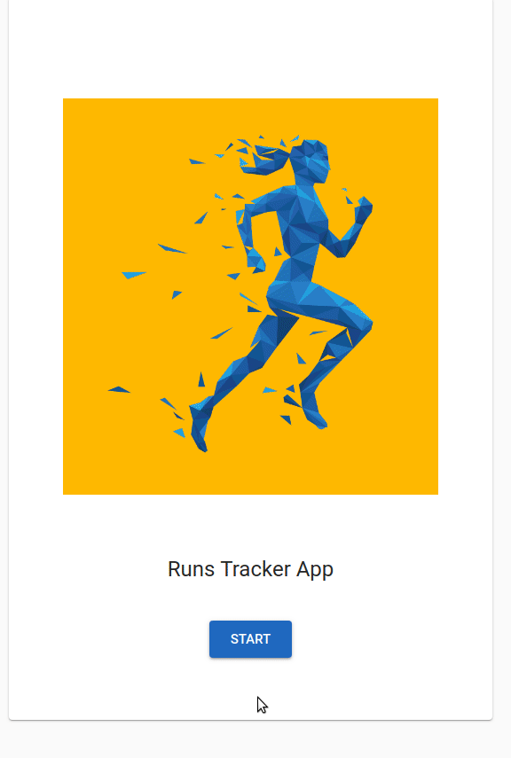

## Run Tracker App - Client

## Demo

## Description

This is the client for a Running Tracker App. When users click **Go to group stats** they are sent to a **Users' List** that displays each user's longest run.

When a user clicks on their name, they are sent to their Runs' Status page, where they can add or delete entries.

The goal of this project was to build a responsive SPA to track users runs taken at different dates and display them in a list and a graph. The project's directories are structured by responsibility.

**Project's status: WIP**
 
## Tech stack

* React
* Redux
* Material-UI
* JavaScript
* Chart.js
* Moment.js
* CSS

## Features

* Start screen and Go to group stats button
* Users' list screen, displaying longest distance run for each user
* User's runs tracking screen
* Line Graph that displays the progresion of runs' distances and times
* Add run, Delete run and Clear list buttons
* Back button that takes you back to the users' list

## Setup

* For the app to run properly you need to instal a JSON-server in order to serve user data from `db.json` through a REST API.
  * The JSON-server exposes a REST API based on a JSON file.
* Install JSON-server using `npm install -g json-server`
* Clone the repository `git clone git@github.com:alex-alina/weight-tracker-app.git`
* Install the dependencies using `yarn install`
* Run the JSON-server using `yarn jsonserve`
  * Make sure the JSON server is running at all times, while your application is running.
* Test that the JSON server is running using httpie `http :4000/users`
* Start the server using `yarn start`

## Future development and improvements

* Show which page that displays runs is currently selected
* Display runs in ascending order inside the chart
* Display runs in descending order inside the list
* Update and refactor project structure (components, views, redux tree, naming)
* Add unit tests
* Fetch users' data from a free mock api (ex. Faker or reqres.in) & drop the JSON-server
* Add back to start screen link/btn
* Add running goal and functionality to congratulate the user the first time they reach it
* Add update old run functionality 

## License

MIT Licence - Copyright &copy; 2019 - Alina Rusu.
